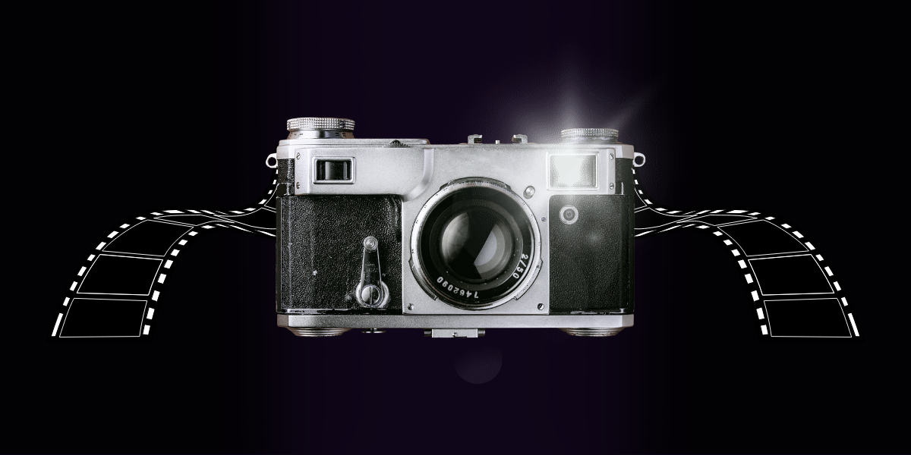
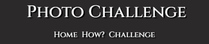
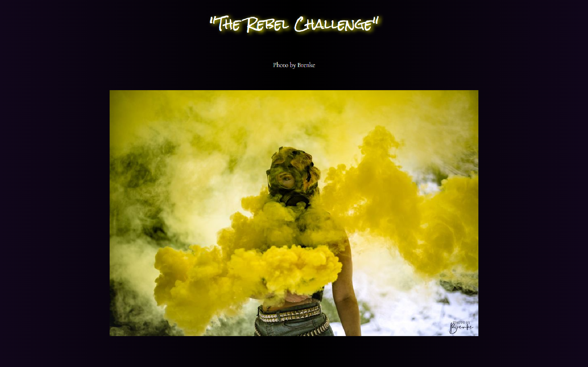
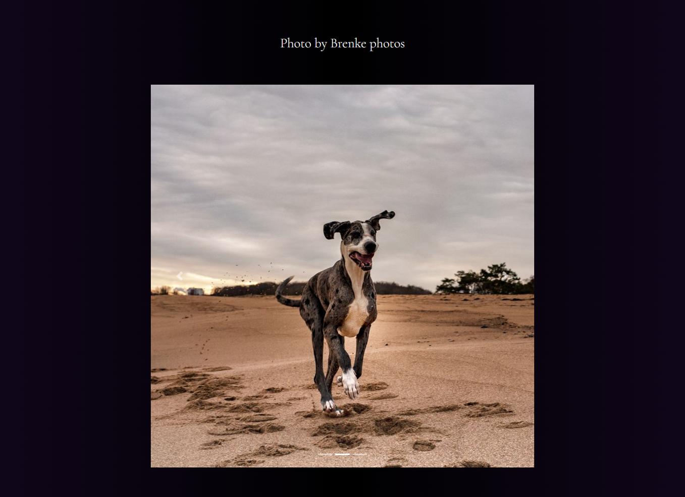
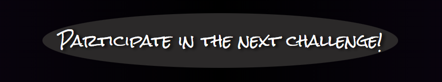
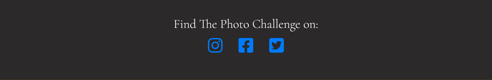

---

# *Photo Challenge*

Photo Challenge is a website where a user can compete with their photography in a challenge and win exposure on the website. The challenges vary each month and the winner gets one month of exposure on the homepage.
The site can be accessed here [link](https://chazzieloves.github.io/photochallenge/)

## Features

+ ### Navbar

+ ##### Navigation
    - Positioned at the top of the page.
    - Contains the logotype of the company on the left side.
    - Contains navigation links on the right side:
        * Home - leads to the "Home" page where users can see the last challenge winner photo and exposure of the winners photography.
        * How? - leads to the "How?" page where users can see past challenge winners and get information about how to participate in a monthly challenge.
        * Challenge - leads to the "challenge form" page the upcoming challenge is presented and users can fill out the form and participate.
    - The links have an animated hover effect.
    - The navigation is clear and easy to understand for the user.

    
   - The navigationbar is responsive:
        * On Mobile devices: The navigationbar splits in two rows.
          

---

+ ### Home Page

  

    - Represent: 

        * Exposure of the past challenge winner.
        * Emphasizing the exposure of the winning photography.
        * Shows other photographies from the challenge winner.
        * Invites to fill out the challenge form.

---

+ #### Hero Section

  

    - Hero section have a background image.
 
  
     
 --- 

+ #### Challenge winner Section

  

    - Highlights the challenge winner-picture.

    - Attracts users who wants to get their art exposed.

 ---

 + #### More art from this photographer Section

    

    - More art from this photographer Section has three more photographies from the winner.

    - Each card has a picture that the photographer get to choose when winning the challenge.

    - The slideshow automatically spins after a few second but can also be spun manually.

  ---
  
+ #### Participate Section

    

    - Participate section encourage user to join in the next challenge by a button.

  
  ---
  
  + #### Footer
 
      

    - Footer contains social media links that opens in a new tab.

  ---

  + ### How? Page
 
     
    
    - How? has a header identical to the Home page
      
    - How? page has a challenge introduction for the visitors that explains how the challenge works.

    - Past challenge winners Section has slideshow with three more photographies, each card has a winning photo from previous challenges.

    - The slideshow automatically spins after a few second but can also be spun manually.
   
    - It has a footer identical to the home page's footer.
   

---
+ ### Challenge page

   

   - Challenge Page has identical header to Home Page
 
   - The page presents the upcoming challenge.

    - Challenge page has a submit form:

        - All text input fields are customized.
        - Labels are animated when the input field is in focus and not empty.
        - All inputs, except phon-number, are set to be required to fill out.

    - The page is responsive on all common screen sizes.

    - The submit button leads to the submit-response page.

---
+ ### Submit-response page

   

    - Submit response page appears after submitting the challenge form.
    - It contains a thank you message and the promise to get in touch with the user when a winner has been selected.
    - There is a return button to the Home page.

---

## Technologies Used

- [HTML](https://developer.mozilla.org/en-US/docs/Web/HTML) - was used as the foundation of the site.
- [CSS](https://developer.mozilla.org/en-US/docs/Web/css) - was used to add the styles and layout of the site.
- [CSS Flexbox](https://css-tricks.com/snippets/css/a-guide-to-flexbox/) - was used to arrange items symmetrical on the pages.
- [CSS Grid](https://developer.mozilla.org/en-US/docs/Web/CSS/grid) - was used to make "How?" and "Challenge" pages responsive.
- [VSCode](https://code.visualstudio.com/) - was used as the main tool to write and edit code.
- [Git](https://git-scm.com/) - was used for the version control of the website.
- [GitHub](https://github.com/) - was used to host the code of the website.
- [Birme](https://www.birme.net/?target_width=600&target_height=800) - was used to resize images for the slideshows.
- [Balsamiq](https://www.balsamiq.com/) - was used to create wireframes for the Home, How? and Challenge page.

---

## Design

### Color Scheme

- A background gradient in black and dark purple was used to make a depth in the background to better highlight the photographies. I added my own design to the background on the submit-response page, that gives the effect of cameras flashing. I created it myself in Canva. This will make the photographers associate it with something they love doing, taking breathtaking photos.

- I used white text color to make the text easily read. It also gives photos displayed on the website more room for colors without the background disturbing.

- Text shadow was used to enhance the upcoming and previous challenge.

### Typography

[Google Font](https://fonts.googleapis.com/css2?family=Cinzel:wght@500&family=Cormorant:wght@300&family=Dancing+Script:wght@700&family=Rock+Salt&display=swap)

- Cormorant Google Font was used as the font of the website in order to increase the creative space of the content on the pages.
- Cinzel Google Font was used as the font of the logo in order to make a clean and minimalistic impression.
- Dancing Script Google Font was used as the font of the next month challenge in order to make it fit the challenge.
- Rock Salt Google Font was used as the font of this month challenge winner in order to draw attetion to the challenge winner.

### Wireframes

#### Desktop

- [Home Page. Desktop Screen](documentation/wireframes/photochallenge-home.png)
- [How? Page. Desktop Screen](documentation/wireframes/photochallenge-how.png)
- [Challenge Page. Desktop Screen](documentation/wireframes/photochallenge-challenge.png)

---

## Testing

- The project was tested through: [Validator](https://validator.w3.org/)

---

## Deployment

- The site was deployed to GitHub pages. The steps to deploy are as followed: 
  - In the [GitHub repository](https://github.com/Chazzieloves/photochallenge), navigate to the Settings tab 
  - From the source section drop-down menu, select the **Main** Branch, then click "Save".
  - The page will automatically refresh with a detailed ribbon display to indicate the successful deployment.

The live link can be found [here](https://chazzieloves.github.io/photochallenge/)

## Local Deployment

In order to make a local copy of this project, you can clone it.
In your IDE Terminal, type the following command to clone my repository:

- `git clone https://github.com/Chazzieloves/photochallenge.git`

---

## Future improvements
- improve the quality of the commit messages (I am aware that some of them are not very clear and not meeting the standards and will improve them in the future);
- correct the slideshow of images so they do not overflow on bigger screens.

---

## Credits

+ #### Content

    - Inspiration for the background gradient effect came from the article "CSS Gradients" published the website [W3 schools etc](https://www.w3schools.com/](https://www.w3schools.com/css/css3_gradients.asp).

  + #### Media

    - All the images for the website were taken from [Unsplash](https://unsplash.com/) or my own design/photo.
    + [Hero image] was made by me in the program Canva.
    + Home page, challenge winner images:
        - All of the images was captured by my friend and photographer Photo by Brenke.
    + How? page, slideshow: 
        - [1st image](https://free-images.com/display/landscape_sunset_mountains_1624987.html);
        - [2nd image](https://free-images.com/display/stone_house_old_house.html);
        - [3rd image](https://free-images.com/display/water_cascade_nature_waters.html).
    + Challenge page:
         - [Next challenge image](https://free-images.com/display/garden_classical_garden_magnolia.html);

+ #### Tools

    - [Birme](https://www.birme.net/) was used to cut the images to fit the slideshow.
    - [Canva](https://www.canva.com/) was used to create both the hero-image and the background for the submit-respons page.
    - [RapidTables](https://www.rapidtables.com/) was used to create the color palette.
 
  ---

## Acknowledgments

- [Code Institute](https://codeinstitute.net/) My mentor that helped me understand errors I made through out this project and encouraged me to keep going.
- [Pierre Balkhed]() my friend who works with IT, he looked at my code and website and gave me valuable advice.
- [Carlo Zancaner]() my partner, sat with me for many hours and helped me with problemsolving.
- [Claudia Zancaner]() my partners mom, she engaged herself and let me explain and teach her about coding, which helped me understand what I was supposed to do moving forward.

---

